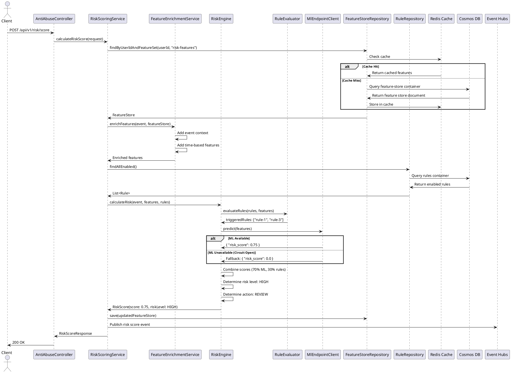

# Sequence Diagram: Risk Scoring Flow

## Steps

1. Client sends risk score request with event details
2. Service loads feature store from Cosmos DB (cached in Redis)
3. Features are enriched with event context and time-based features
4. Enabled rules are loaded from Cosmos DB
5. Rules are evaluated against enriched features
6. ML endpoint is called for predictive risk score (with circuit breaker)
7. Scores are combined (70% ML, 30% rules)
8. Risk level and action are determined
9. Risk score is returned and optionally published to Event Hubs

## Error Handling

- **ML Timeout**: Falls back to rule-based score only
- **Circuit Open**: Returns 0.0 ML score, continues with rules
- **Feature Store Missing**: Creates empty feature store
- **Rule Evaluation Error**: Logs warning, continues with ML only

