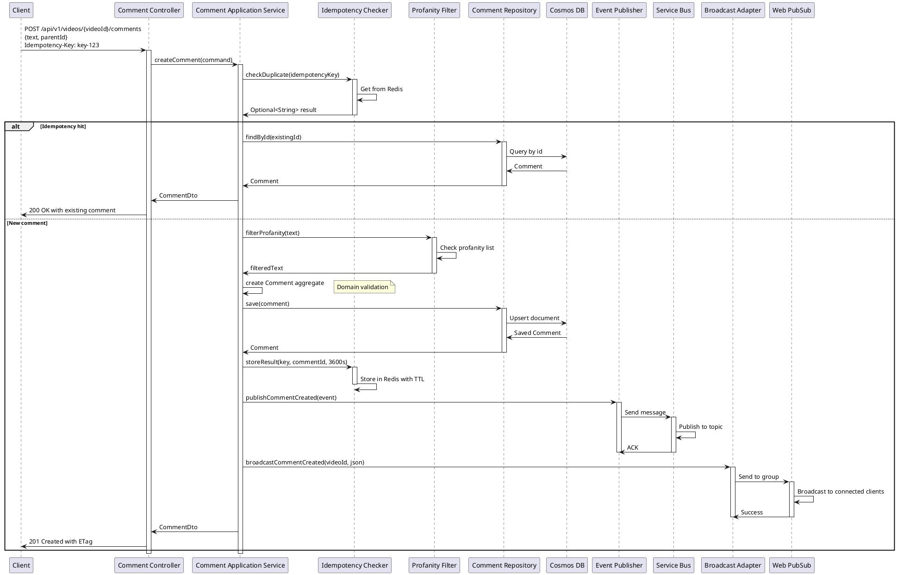

# Create Comment Sequence Diagram

## Overview
This sequence diagram shows the flow for creating a comment with idempotency, profanity filtering, and real-time broadcasting.

## Sequence Flow

## Key Points

1. **Idempotency Check**: First step checks Redis for existing request
2. **Profanity Filtering**: Text is filtered before persistence
3. **Domain Validation**: Comment aggregate enforces business rules
4. **Atomic Persistence**: Saves to Cosmos DB with partition key
5. **Event Publishing**: Publishes domain event to Service Bus
6. **Real-time Broadcast**: Broadcasts to Web PubSub for live updates

## Error Handling

- Idempotency: Returns existing comment if key exists
- Profanity: Filters and logs violation
- Repository: Throws IllegalArgumentException on invalid data
- Broadcasting: Non-blocking, best-effort (doesn't fail request)

## Performance Considerations

- Redis lookup: O(1) for idempotency check
- Cosmos DB write: ~20ms (partitioned by videoId)
- Service Bus: Async with retry
- Web PubSub: Non-blocking, fire-and-forget

## Resilience Patterns Applied

1. **Circuit Breaker**: On Cosmos DB and Service Bus
2. **Retry**: On transient failures
3. **Bulkhead**: Isolates event publishing
4. **Rate Limiter**: Prevents spam (10/60s per user)

