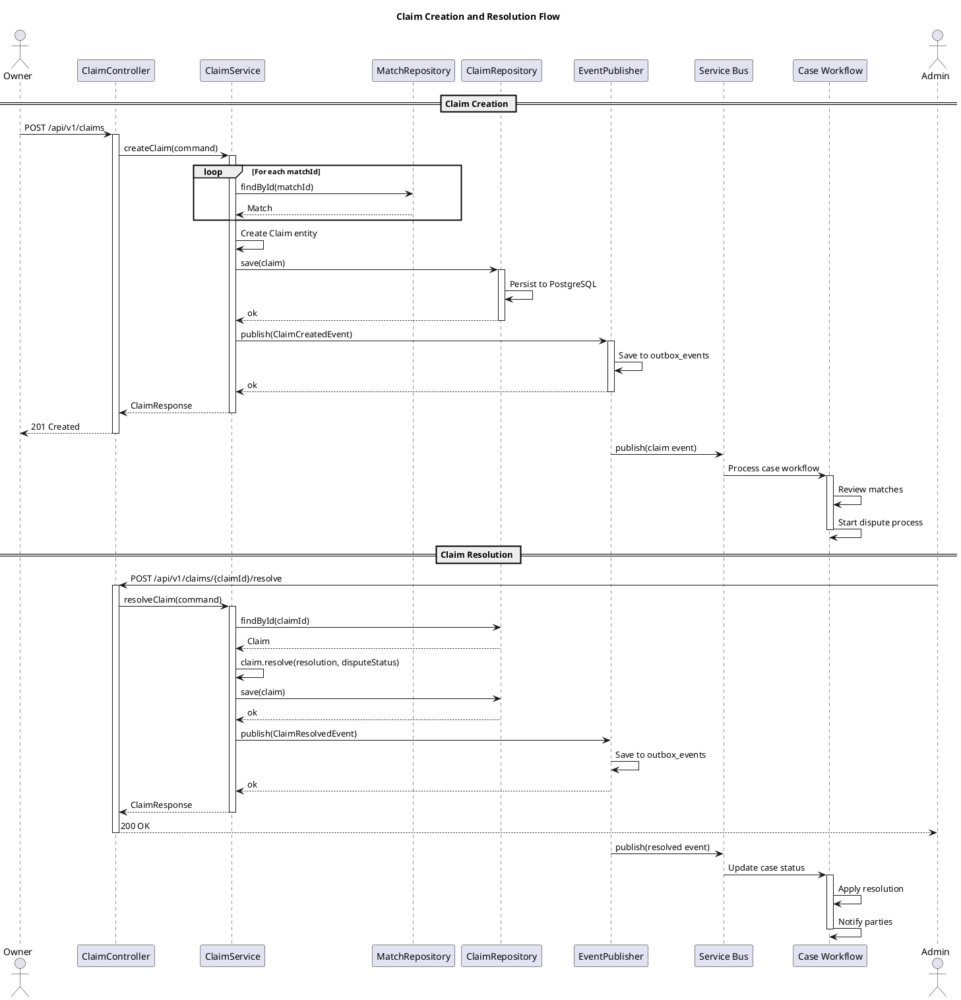

# Claim Creation and Resolution Sequence

```plantuml
@startuml
title Claim Creation and Resolution Flow

actor Owner
participant "ClaimController" as Controller
participant "ClaimService" as Service
participant "MatchRepository" as MatchRepo
participant "ClaimRepository" as ClaimRepo
participant "EventPublisher" as Publisher
participant "Service Bus" as SB
participant "Case Workflow" as Workflow

== Claim Creation ==

Owner -> Controller: POST /api/v1/claims
activate Controller

Controller -> Service: createClaim(command)
activate Service

loop For each matchId
    Service -> MatchRepo: findById(matchId)
    MatchRepo --> Service: Match
end

Service -> Service: Create Claim entity
Service -> ClaimRepo: save(claim)
activate ClaimRepo
ClaimRepo -> ClaimRepo: Persist to PostgreSQL
ClaimRepo --> Service: ok
deactivate ClaimRepo

Service -> Publisher: publish(ClaimCreatedEvent)
activate Publisher
Publisher -> Publisher: Save to outbox_events
Publisher --> Service: ok
deactivate Publisher

Service --> Controller: ClaimResponse
deactivate Service

Controller --> Owner: 201 Created
deactivate Controller

Publisher -> SB: publish(claim event)
SB -> Workflow: Process case workflow
activate Workflow
Workflow -> Workflow: Review matches
Workflow -> Workflow: Start dispute process
deactivate Workflow

== Claim Resolution ==

actor Admin
Admin -> Controller: POST /api/v1/claims/{claimId}/resolve
activate Controller

Controller -> Service: resolveClaim(command)
activate Service

Service -> ClaimRepo: findById(claimId)
ClaimRepo --> Service: Claim

Service -> Service: claim.resolve(resolution, disputeStatus)
Service -> ClaimRepo: save(claim)
ClaimRepo --> Service: ok

Service -> Publisher: publish(ClaimResolvedEvent)
Publisher -> Publisher: Save to outbox_events
Publisher --> Service: ok

Service --> Controller: ClaimResponse
deactivate Service

Controller --> Admin: 200 OK
deactivate Controller

Publisher -> SB: publish(resolved event)
SB -> Workflow: Update case status
activate Workflow
Workflow -> Workflow: Apply resolution
Workflow -> Workflow: Notify parties
deactivate Workflow

@enduml
```

