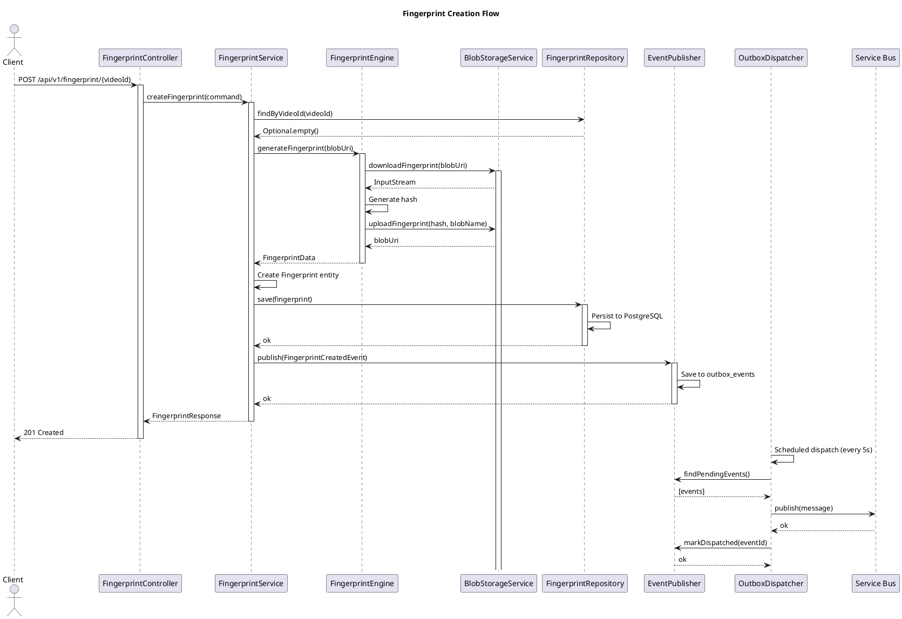

# Fingerprint Creation Sequence

```plantuml
@startuml
title Fingerprint Creation Flow

actor Client
participant "FingerprintController" as Controller
participant "FingerprintService" as Service
participant "FingerprintEngine" as Engine
participant "BlobStorageService" as Blob
participant "FingerprintRepository" as Repo
participant "EventPublisher" as Publisher
participant "OutboxDispatcher" as Dispatcher
participant "Service Bus" as SB

Client -> Controller: POST /api/v1/fingerprint/{videoId}
activate Controller

Controller -> Service: createFingerprint(command)
activate Service

Service -> Repo: findByVideoId(videoId)
Repo --> Service: Optional.empty()

Service -> Engine: generateFingerprint(blobUri)
activate Engine

Engine -> Blob: downloadFingerprint(blobUri)
activate Blob
Blob --> Engine: InputStream

Engine -> Engine: Generate hash
Engine -> Blob: uploadFingerprint(hash, blobName)
Blob --> Engine: blobUri

Engine --> Service: FingerprintData
deactivate Engine

Service -> Service: Create Fingerprint entity
Service -> Repo: save(fingerprint)
activate Repo
Repo -> Repo: Persist to PostgreSQL
Repo --> Service: ok
deactivate Repo

Service -> Publisher: publish(FingerprintCreatedEvent)
activate Publisher
Publisher -> Publisher: Save to outbox_events
Publisher --> Service: ok
deactivate Publisher

Service --> Controller: FingerprintResponse
deactivate Service

Controller --> Client: 201 Created
deactivate Controller

Dispatcher -> Dispatcher: Scheduled dispatch (every 5s)
Dispatcher -> Publisher: findPendingEvents()
Publisher --> Dispatcher: [events]

Dispatcher -> SB: publish(message)
SB --> Dispatcher: ok

Dispatcher -> Publisher: markDispatched(eventId)
Publisher --> Dispatcher: ok

@enduml
```

