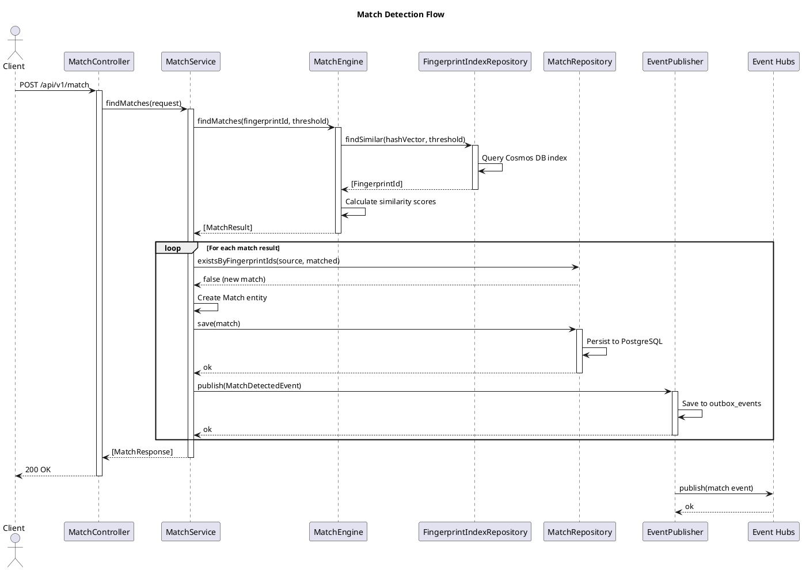

# Match Detection Sequence

```plantuml
@startuml
title Match Detection Flow

actor Client
participant "MatchController" as Controller
participant "MatchService" as Service
participant "MatchEngine" as Engine
participant "FingerprintIndexRepository" as IndexRepo
participant "MatchRepository" as MatchRepo
participant "EventPublisher" as Publisher
participant "Event Hubs" as EH

Client -> Controller: POST /api/v1/match
activate Controller

Controller -> Service: findMatches(request)
activate Service

Service -> Engine: findMatches(fingerprintId, threshold)
activate Engine

Engine -> IndexRepo: findSimilar(hashVector, threshold)
activate IndexRepo
IndexRepo -> IndexRepo: Query Cosmos DB index
IndexRepo --> Engine: [FingerprintId]
deactivate IndexRepo

Engine -> Engine: Calculate similarity scores
Engine --> Service: [MatchResult]
deactivate Engine

loop For each match result
    Service -> MatchRepo: existsByFingerprintIds(source, matched)
    MatchRepo --> Service: false (new match)
    
    Service -> Service: Create Match entity
    Service -> MatchRepo: save(match)
    activate MatchRepo
    MatchRepo -> MatchRepo: Persist to PostgreSQL
    MatchRepo --> Service: ok
    deactivate MatchRepo
    
    Service -> Publisher: publish(MatchDetectedEvent)
    activate Publisher
    Publisher -> Publisher: Save to outbox_events
    Publisher --> Service: ok
    deactivate Publisher
end

Service --> Controller: [MatchResponse]
deactivate Service

Controller --> Client: 200 OK
deactivate Controller

Publisher -> EH: publish(match event)
EH --> Publisher: ok

@enduml
```

