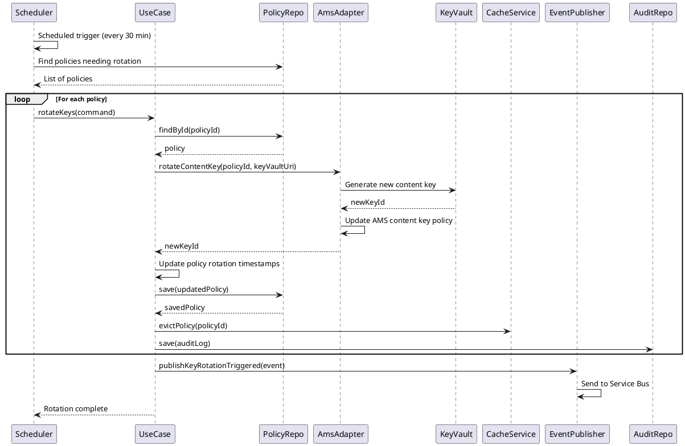

# Key Rotation Sequence

## Sequence Diagram

## Flow Description

1. **Scheduler Trigger**: Scheduled job runs every 30 minutes (configurable)
2. **Policy Discovery**: Find all policies where `nextRotationAt <= now`
3. **For Each Policy**: Process each policy requiring rotation
4. **Retrieve Policy**: Load policy from repository
5. **Key Generation**: Generate new content key in Azure Key Vault
6. **AMS Update**: Update Azure Media Services with new content key
7. **Policy Update**: Update rotation timestamps in policy
8. **Cache Invalidation**: Remove cached policy
9. **Audit Logging**: Create audit log entry for key rotation
10. **Event Publishing**: Publish key rotation event to Service Bus
11. **Completion**: Mark rotation as complete for all policies

