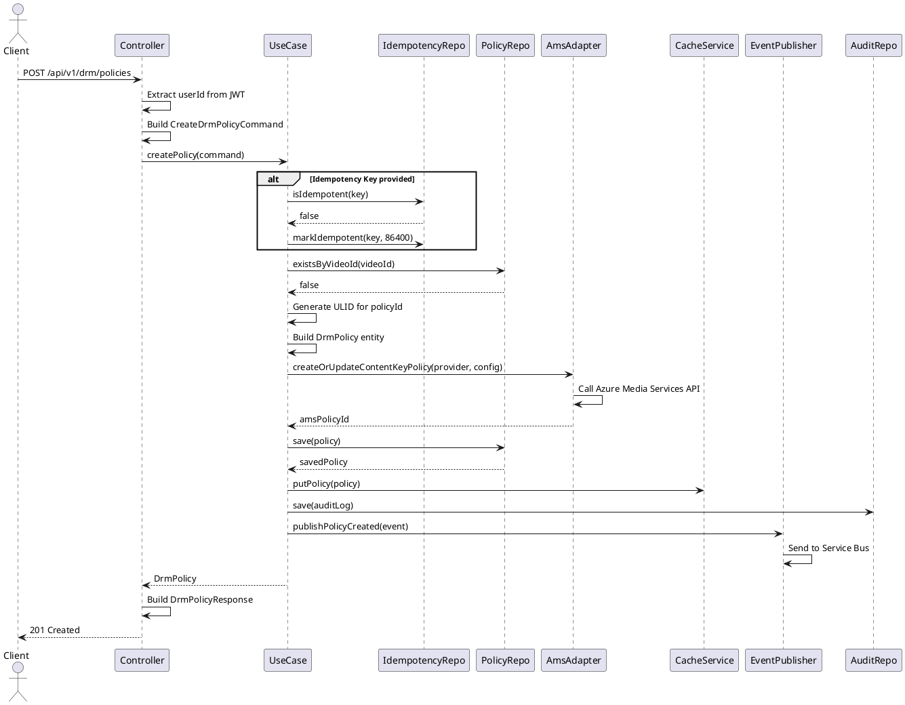

# DRM Policy Creation Sequence

## Sequence Diagram

## Flow Description

1. **Request Reception**: Client sends POST request with DRM policy details
2. **Authentication**: Controller extracts user ID from JWT token
3. **Idempotency Check**: If idempotency key provided, check if operation already executed
4. **Validation**: Check if DRM policy already exists for the video
5. **Policy Creation**: Generate unique policy ID and create policy entity
6. **AMS Integration**: Create content key policy in Azure Media Services
7. **Persistence**: Save policy to PostgreSQL database
8. **Caching**: Store policy in Redis cache
9. **Audit Logging**: Create audit log entry for policy creation
10. **Event Publishing**: Publish policy created event to Service Bus
11. **Response**: Return created policy with 201 status

