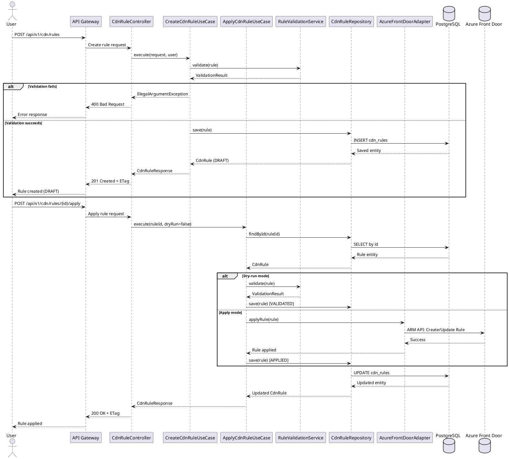

# Sequence Diagram: Rule Create and Apply Flow

## Description

1. **Create Rule**: User creates a new rule via REST API
   - Rule is validated using domain validation service
   - If valid, rule is saved in DRAFT status
   - Returns rule with ETag for optimistic locking

2. **Apply Rule**: User applies a validated rule
   - Rule is retrieved from repository
   - In dry-run mode, only validation is performed
   - In apply mode, rule is sent to Azure Front Door via ARM API
   - Rule status is updated to APPLIED on success
   - ETag is updated for version control

