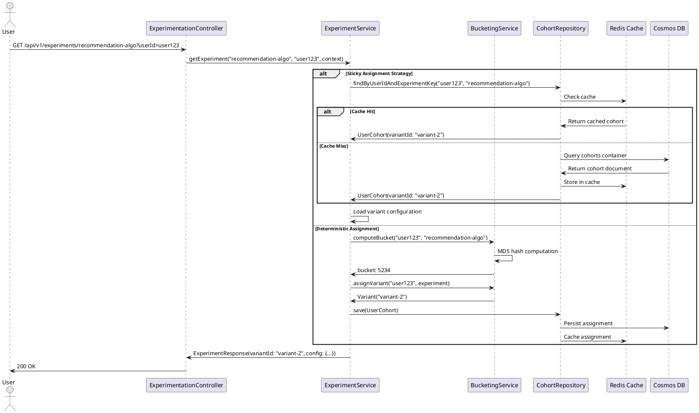

# Sequence Diagram: Experiment Assignment

## Steps

1. User requests experiment variant
2. Service checks experiment assignment strategy
3. **Sticky**: Look up existing assignment in cohort repository
4. **Deterministic**: Compute bucket using MD5 hash of userId + experimentKey
5. Assign variant based on cumulative traffic percentages
6. Persist assignment in Cosmos DB (for sticky/audit)
7. Cache in Redis for fast lookups
8. Return variant configuration

## Bucketing Details

- Hash input: `userId + ":" + experimentKey`
- Bucket range: 0-9999
- Variant assignment: Cumulative percentage check
- Deterministic: Same user always gets same bucket

