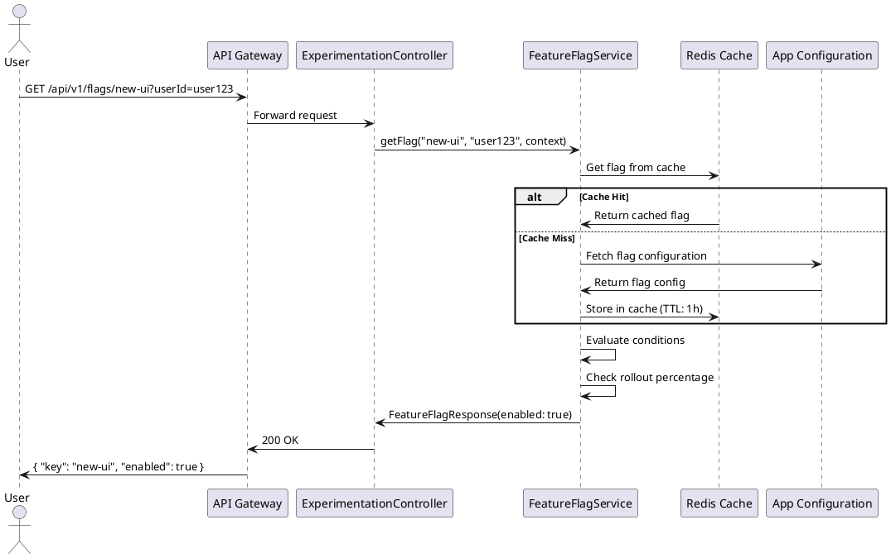

# Sequence Diagram: Feature Flag Resolution

## Steps

1. User requests feature flag with userId and context
2. Service checks Redis cache first
3. On cache miss, fetches from Azure App Configuration
4. Evaluates conditions (region, user segment, etc.)
5. Checks rollout percentage using deterministic bucketing
6. Returns enabled/disabled flag
7. Caches result for 1 hour

