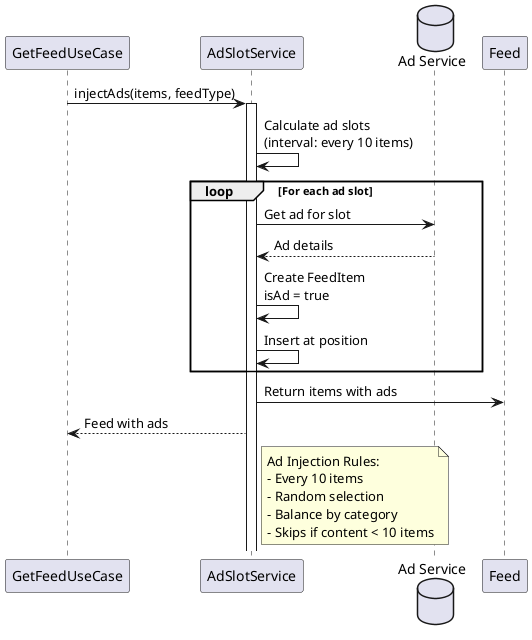

# Ad Injection Sequence



## Ad Injection Algorithm

### Position Strategy

- **Interval**: Every 10 items
- **Index**: Position = 10, 20, 30, ...
- **Skip**: If feed has less than 10 items

### Ad Selection

```java
// Ad slots
- Slot 1: Position 10
- Slot 2: Position 20
- Slot 3: Position 30
```

### Example Output

```
Items 1-9: Videos
Item 10:   Ad #1 (isAd: true)
Items 11-19: Videos
Item 20:   Ad #2 (isAd: true)
...
```

## Metadata

Each ad includes:
- `isAd: true`
- `adSlotIndex: 1, 2, 3...`
- `videoId: "ad-xxx"`
- `category: "AD"`

