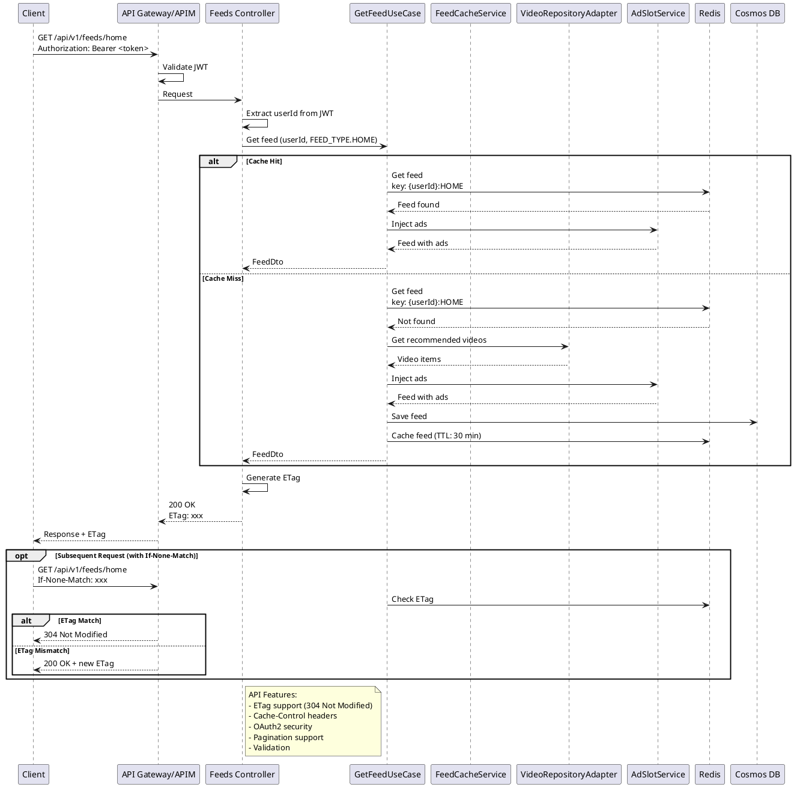

# Get Feed Request Sequence

## Flow Description

### Cache Hit Path
1. Request arrives with OAuth2 token
2. Extract userId from JWT
3. Check Redis cache
4. Inject ads into cached feed
5. Return with ETag

### Cache Miss Path
1. Request arrives
2. Cache miss in Redis
3. Fetch videos from video repository
4. Inject ads
5. Persist to Cosmos DB
6. Cache in Redis (30 min TTL)
7. Return with ETag

### Subsequent Request
1. Client includes `If-None-Match` header
2. Compare ETags
3. Return 304 if unchanged
4. Return 200 if changed

## Performance

- **Cache Hit**: ~50ms
- **Cache Miss**: ~500ms (video fetch + ad injection)
- **Cache TTL**: 30 minutes
- **ETag Support**: Reduces bandwidth

