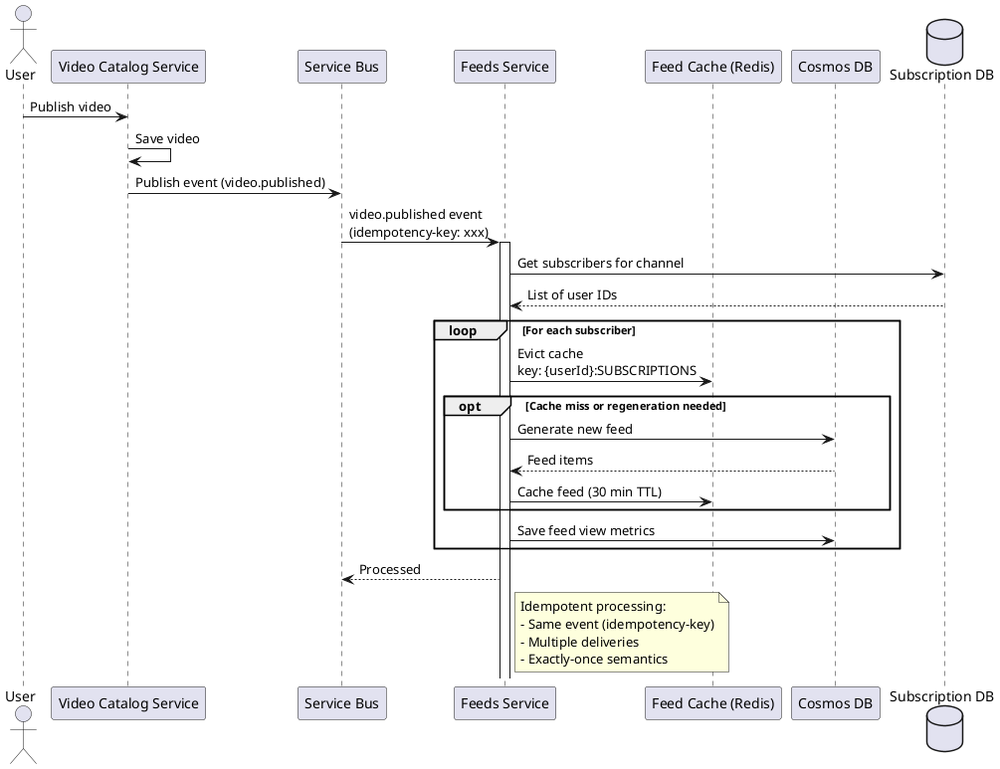

# Video Published Fan-out Sequence

## Description

When a video is published, the feeds service:

1. Receives `video.published` event from Service Bus
2. Retrieves all users subscribed to the video's channel
3. For each subscriber:
   - Evicts their subscriptions feed cache
   - Optionally regenerates feed (async)
   - Tracks view metrics
4. Process is idempotent using `idempotency-key` header

## Resilience

- **Retry**: Failed event processing retries up to 3 times
- **Circuit Breaker**: Opens if external services fail
- **Timeout**: 30 second timeout for fan-out operations

