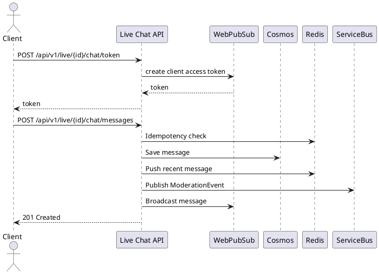

# Sequence: connect -> token -> send -> broadcast

```plantuml
@startuml
actor Client
participant API as "Live Chat API"
participant WebPubSub
participant Cosmos
participant Redis
participant ServiceBus as SB

Client -> API: POST /api/v1/live/{id}/chat/token
API -> WebPubSub: create client access token
WebPubSub --> API: token
API --> Client: token

Client -> API: POST /api/v1/live/{id}/chat/messages
API -> Redis: Idempotency check
API -> Cosmos: Save message
API -> Redis: Push recent message
API -> SB: Publish ModerationEvent
API -> WebPubSub: Broadcast message
API --> Client: 201 Created
@enduml
```
