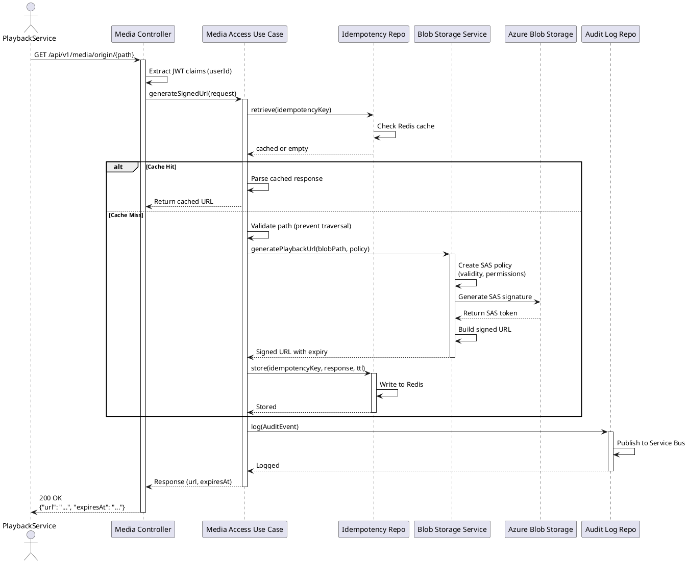

# Sequence Diagram: Playback Service Requesting Signed URL

## Overview

This diagram shows the flow when a playback service requests a signed URL for media content.

## PlantUML Diagram

## Sequence Description

1. **Playback Service Request**: Playback service makes authenticated request with blob path
2. **Authentication**: Controller validates JWT token and extracts user ID
3. **Idempotency Check**: Service checks for cached response using Idempotency-Key
4. **Path Validation**: Normalize and validate path to prevent directory traversal
5. **SAS Generation**: Generate playback-optimized SAS URL with extended validity
6. **Cache Result**: Store generated URL in Redis for idempotency
7. **Audit Logging**: Publish audit event to Service Bus for compliance
8. **Return Signed URL**: Return signed URL to playback service

## Security Considerations

- **Path Traversal Protection**: All paths are normalized and validated
- **HTTPS Only**: SAS URLs enforce HTTPS in production
- **Audit Trail**: All access events are logged
- **Idempotency**: Prevents duplicate operations
- **Token Expiry**: URLs have configurable expiration

 viewed/allowed

