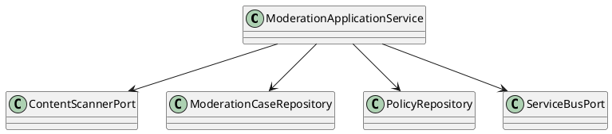

### Low-Level Design

Hexagonal architecture:
- domain: `ModerationCase`, `Strike`, `PolicyThreshold`
- application: service orchestrating scan->case->queue
- infrastructure: adapters (Azure Content Safety, Cosmos, Service Bus), web controller

Class diagram (simplified):

