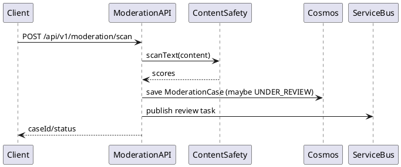

### Sequence: upload -> scan -> case -> decision

```plantuml
@startuml
participant Client
participant ModerationAPI
participant ContentSafety
participant Cosmos
participant ServiceBus

Client -> ModerationAPI: POST /api/v1/moderation/scan
ModerationAPI -> ContentSafety: scanText(content)
ContentSafety --> ModerationAPI: scores
ModerationAPI -> Cosmos: save ModerationCase (maybe UNDER_REVIEW)
ModerationAPI -> ServiceBus: publish review task
ModerationAPI --> Client: caseId/status
@enduml
```

