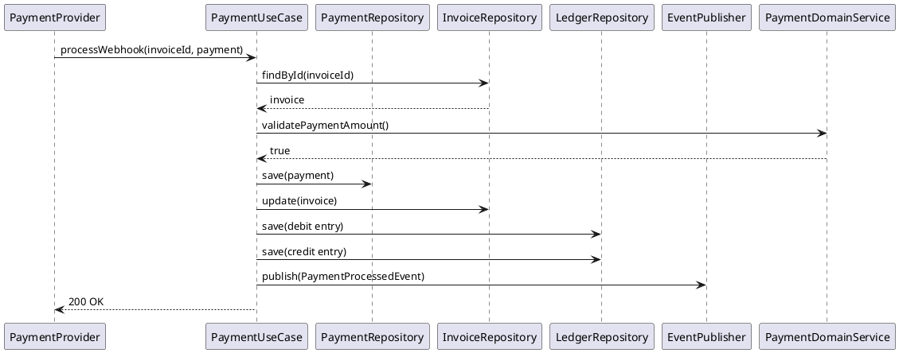

# Monetization and Billing Service

Production-grade microservice for managing revenue share, payouts, memberships, and invoicing.

## Overview

This service implements a hexagonal architecture with:
- **Domain Layer**: Core business logic with entities (Membership, Invoice, Ledger, Payment), value objects (Money, PaymentStatus, MembershipTier), and domain events
- **Application Layer**: Use cases and services implementing business workflows with SAGA pattern for reliable transaction processing
- **Infrastructure Layer**: JPA repositories, Service Bus adapters, Key Vault integration for secrets

## Key Features

- **Double-Entry Bookkeeping**: All financial transactions recorded in ledger with debit/credit entries
- **SAGA Pattern**: Membership lifecycle managed with compensation transactions
- **Idempotency**: Webhook replay defense via Idempotency-Key header and Redis deduplication
- **Strong Consistency**: ACID transactions across membership, payment, invoice, and ledger tables
- **Outbox Pattern**: Reliable event publishing to Service Bus for analytics
- **Webhook Verification**: HMAC-SHA256 signature validation for payment provider webhooks
- **Optimistic Concurrency**: ETag-based version control for concurrent updates

## Architecture

### Domain Model

```
Membership (Aggregate Root)
├── Subscription lifecycle management
├── Payment processing
└── Tiers: Basic, Premium, Elite

Invoice
├── Billing generation
├── Payment tracking
└── Status management

Payment
├── External payment ID mapping
├── Status tracking
└── Refund handling

Ledger
├── Double-entry bookkeeping
├── Debit/Credit entries
└── Transaction reference tracking
```

### Database Schema (PostgreSQL)

```sql
-- Membership table
CREATE TABLE memberships (
    id VARCHAR PRIMARY KEY,
    channel_id VARCHAR NOT NULL,
    subscriber_id VARCHAR NOT NULL,
    tier VARCHAR NOT NULL,
    monthly_fee_amount DECIMAL(19,4) NOT NULL,
    monthly_fee_currency VARCHAR(3) NOT NULL,
    status VARCHAR NOT NULL,
    start_date TIMESTAMP NOT NULL,
    end_date TIMESTAMP,
    next_billing_date TIMESTAMP,
    payment_method_id VARCHAR,
    external_subscription_id VARCHAR,
    version INT NOT NULL,
    created_at TIMESTAMP NOT NULL,
    updated_at TIMESTAMP NOT NULL,
    etag VARCHAR,
    UNIQUE(channel_id, subscriber_id)
);

-- Invoice table
CREATE TABLE invoices (
    id VARCHAR PRIMARY KEY,
    membership_id VARCHAR NOT NULL,
    channel_id VARCHAR NOT NULL,
    subscriber_id VARCHAR NOT NULL,
    amount DECIMAL(19,4) NOT NULL,
    currency VARCHAR(3) NOT NULL,
    status VARCHAR NOT NULL,
    due_date TIMESTAMP NOT NULL,
    paid_date TIMESTAMP,
    payment_id VARCHAR,
    version INT NOT NULL,
    created_at TIMESTAMP NOT NULL,
    updated_at TIMESTAMP NOT NULL,
    etag VARCHAR
);

-- Payment table
CREATE TABLE payments (
    id VARCHAR PRIMARY KEY,
    invoice_id VARCHAR NOT NULL,
    membership_id VARCHAR NOT NULL,
    payment_method_id VARCHAR NOT NULL,
    amount DECIMAL(19,4) NOT NULL,
    currency VARCHAR(3) NOT NULL,
    status VARCHAR NOT NULL,
    external_payment_id VARCHAR UNIQUE NOT NULL,
    transaction_date TIMESTAMP NOT NULL,
    failure_reason TEXT,
    refunded_date TIMESTAMP,
    version INT NOT NULL,
    created_at TIMESTAMP NOT NULL,
    updated_at TIMESTAMP NOT NULL,
    etag VARCHAR
);

-- Ledger table (double-entry bookkeeping)
CREATE TABLE ledger (
    id VARCHAR PRIMARY KEY,
    transaction_ref VARCHAR NOT NULL,
    account_type VARCHAR NOT NULL,
    account_code VARCHAR NOT NULL,
    entry_type VARCHAR NOT NULL,
    amount DECIMAL(19,4) NOT NULL,
    currency VARCHAR(3) NOT NULL,
    transaction_date TIMESTAMP NOT NULL,
    description TEXT,
    related_ref VARCHAR,
    version INT NOT NULL,
    created_at TIMESTAMP NOT NULL,
    updated_at TIMESTAMP NOT NULL
);

-- Outbox table for reliable event publishing
CREATE TABLE outbox (
    id VARCHAR PRIMARY KEY,
    aggregate_type VARCHAR NOT NULL,
    aggregate_id VARCHAR NOT NULL,
    event_type VARCHAR NOT NULL,
    payload_json TEXT NOT NULL,
    occurred_at TIMESTAMP NOT NULL,
    processed BOOLEAN DEFAULT FALSE
);

-- Idempotency table
CREATE TABLE idempotency_keys (
    key VARCHAR PRIMARY KEY,
    result TEXT,
    expires_at TIMESTAMP NOT NULL,
    created_at TIMESTAMP NOT NULL
);
```

## API Endpoints

### Membership Management

#### POST /api/v1/memberships/subscribe
Create a new membership subscription.

**Request:**
```json
{
  "channelId": "channel_123",
  "tier": "PREMIUM",
  "monthlyFeeAmount": 4.99,
  "currency": "USD",
  "paymentMethodId": "pm_123"
}
```

**Response:**
```json
{
  "id": "membership_456",
  "channelId": "channel_123",
  "subscriberId": "user_789",
  "tier": "PREMIUM",
  "monthlyFeeAmount": 4.99,
  "currency": "USD",
  "status": "ACTIVE",
  "startDate": "2024-01-15T10:00:00Z",
  "nextBillingDate": "2024-02-15T10:00:00Z",
  "createdAt": "2024-01-15T10:00:00Z",
  "updatedAt": "2024-01-15T10:00:00Z"
}
```

#### GET /api/v1/memberships/{membershipId}
Get membership details.

#### GET /api/v1/memberships?subscriberId={userId}
List all memberships for a subscriber.

#### GET /api/v1/memberships?channelId={channelId}
List all memberships for a channel.

### Invoice Management

#### GET /api/v1/invoices?membershipId={id}
List invoices for a membership.

**Response:**
```json
{
  "items": [
    {
      "id": "invoice_123",
      "membershipId": "membership_456",
      "channelId": "channel_123",
      "subscriberId": "user_789",
      "amount": 4.99,
      "currency": "USD",
      "status": "COMPLETED",
      "dueDate": "2024-02-15T10:00:00Z",
      "paidDate": "2024-02-14T08:30:00Z",
      "createdAt": "2024-01-15T10:00:00Z"
    }
  ],
  "page": 0,
  "size": 20,
  "totalElements": 1,
  "totalPages": 1
}
```

### Payment Webhooks

#### POST /api/v1/payments/webhook
Process payment provider webhook.

**Headers:**
- `Idempotency-Key`: Unique request identifier
- `X-Signature`: HMAC-SHA256 signature

**Request:**
```json
{
  "invoiceId": "invoice_123",
  "externalPaymentId": "stripe_txn_456",
  "amount": 4.99,
  "currency": "USD",
  "status": "completed"
}
```

## Sequence Diagrams

### Membership Subscription Flow

```plantuml
@startuml
participant Client
participant MembershipUseCase
participant MembershipRepository
participant PaymentUseCase
participant EventPublisher
participant OutboxProcessor
participant ServiceBus

Client -> MembershipUseCase: subscribe(subscriberId, request)
MembershipUseCase -> MembershipRepository: findByChannelIdAndSubscriberId()
MembershipRepository --> MembershipUseCase: Optional.empty()
MembershipUseCase -> MembershipRepository: save(membership)
MembershipRepository --> MembershipUseCase: saved
MembershipUseCase -> EventPublisher: publish(MembershipCreatedEvent)
EventPublisher -> OutboxProcessor: store event in outbox
MembershipUseCase --> Client: MembershipResponse

OutboxProcessor -> ServiceBus: publish event
ServiceBus --> OutboxProcessor: ack
OutboxProcessor: mark event processed
@enduml
```

### Payment Webhook Processing Flow



## Local Development

### Prerequisites
- Java 17+
- Maven 3.8+
- PostgreSQL 14+
- Docker & Docker Compose

### Running with Docker Compose

```bash
# Start PostgreSQL, Redis, and Azurite emulators
docker-compose up -d

# Run the service
mvn spring-boot:run
```

### Running with Emulators

```bash
# Start PostgreSQL
docker run -d -p 5432:5432 -e POSTGRES_PASSWORD=postgres postgres:14

# Start Redis
docker run -d -p 6379:6379 redis:7

# Run with local profile
mvn spring-boot:run -Dspring-boot.run.profiles=local
```

## Configuration

### application.yml

```yaml
spring:
  application:
    name: monetization-service
  
  datasource:
    url: jdbc:postgresql://localhost:5432/monetization
    username: postgres
    password: postgres
  
  jpa:
    hibernate:
      ddl-auto: none
    properties:
      hibernate:
        dialect: org.hibernate.dialect.PostgreSQLDialect
        show_sql: false
  
  data:
    redis:
      host: localhost
      port: 6379
  
azure:
  servicebus:
    namespace: ${AZURE_SB_NAMESPACE}
    connection-string: ${AZURE_SB_CONNECTION_STRING}
    topics:
      billing-events: generar-events
  
  keyvault:
    uri: ${AZURE_KEYVAULT_URI}
  
  appconfiguration:
    endpoint: ${AZURE_APP_CONFIGURATION_ENDPOINT}

resilience4j:
  retry:
    instances:
      payment-webhook:
        maxAttempts: 3
        waitDuration: 1s
  circuitbreaker:
    instances:
      payment-provider:
        slidingWindowSize: 10
        permittedNumberOfCallsInHalfOpenState: 3
        waitDurationInOpenState: 10s

monetization:
  payment:
    webhook-secret-key: ${PAYMENT_WEBHOOK_SECRET_KEY}
    idempotency-ttl: 86400 # 24 hours
```

### Environment Variables

```bash
# Azure
AZURE_SB_NAMESPACE=your-namespace
AZURE_SB_CONNECTION_STRING=Endpoint=sb://...
AZURE_KEYVAULT_URI=https://your-keyvault.vault.azure.net/
AZURE_APP_CONFIGURATION_ENDPOINT=https://your-appconfig.azconfig.io

# Payment Provider
PAYMENT_WEBHOOK_SECRET_KEY=sk_live_...

# Database
POSTGRES_URL=jdbc:postgresql://localhost:5432/monetization
POSTGRES_USERNAME=postgres
POSTGRES_PASSWORD=postgres

# Security
SPRING_SECURITY_OAUTH2_RESOURCESERVER_JWT_ISSUER_URI=https://your-tenant.b2clogin.com/...
```

## Kubernetes Deployment

### Deployment Manifest

```yaml
apiVersion: apps/v1
kind: Deployment
metadata:
  name: monetization-service
spec:
  replicas: 3
  selector:
    matchLabels:
      app: monetization-service
  template:
    metadata:
      labels:
        app: monetization-service
    spec:
      containers:
      - name: app
        image: monetization-service:latest
        ports:
        - containerPort: 8080
        env:
        - name: SPRING_PROFILES_ACTIVE
          value: production
        - name: AZURE_SB_NAMESPACE
          valueFrom:
            secretKeyRef:
              name: azure-secrets
              key: sb-namespace
        - name: POSTGRES_URL
          valueFrom:
            secretKeyRef:
              name: postgres-secrets
              key: url
        resources:
          requests:
            memory: "512Mi"
            cpu: "500m"
          limits:
            memory: "1Gi"
            cpu: "1000m"
        livenessProbe:
          httpGet:
            path: /actuator/health/liveness
            port: 8080
          initialDelaySeconds: 60
          periodSeconds: 30
        readinessProbe:
          httpGet:
            path: /actuator/health/readiness
            port: 8080
          initialDelaySeconds: 30
          periodSeconds: 10
---
apiVersion: autoscaling/v2
kind: HorizontalPodAutoscaler
metadata:
  name: monetization-service-hpa
spec:
  scaleTargetRef:
    apiVersion: apps/v1
    kind: Deployment
    name: monetization-service
  minReplicas: 3
  maxReplicas: 10
  metrics:
  - type: Resource
    resource:
      name: cpu
      target:
        type: Utilization
        averageUtilization: 70
  - type: Resource
    resource:
      name: memory
      target:
        type: Utilization
        averageUtilization: 80
```

## Testing

### Unit Tests

```bash
mvn test
```

### Integration Tests (Testcontainers)

```bash
mvn verify
```

### Load Testing

```bash
# JMH benchmarks
mvn clean compile exec:java -Dexec.mainClass="com.youtube.monetizationservice.benchmark.PaymentBenchmark"

# Gatling simulation
mvn gatling:test
```

## Observability

- **Traces**: OpenTelemetry integration with Azure Monitor
- **Metrics**: Prometheus metrics exposed at `/actuator/prometheus`
- **Logs**: Structured JSON logging with correlation IDs
- **Health Checks**: `/actuator/health`, `/actuator/health/liveness`, `/actuator/health/readiness`

## Security

- **OAuth2 Resource Server**: JWT validation with Entra External ID/B2C
- **API Key Vault**: Secrets stored in Azure Key Vault
- **Webhook Verification**: HMAC-SHA256 signature validation
- **Rate Limiting**: Resilience4j rate limiter
- **Idempotency**: Redis-based deduplication

## Compliance & Financial

- **Double-Entry Bookkeeping**: All transactions recorded with debit/credit entries
- **Audit Trail**: Complete transaction history in ledger
- **Strong Consistency**: ACID transactions for financial operations
- **Reconciliation**: Periodic balance verification across accounts
- **GDPR**: Data retention and right-to-be-forgotten policies

## Production Checklist

- [ ] Database migrations applied (Liquibase/Flyway)
- [ ] Secrets configured in Key Vault
- [ ] Service Bus topics/queues created
- [ ] Redis cluster provisioned
- [ ] Monitoring dashboards configured
- [ ] Alerting rules set up
- [ ] Load testing completed
- [ ] Disaster recovery plan documented
- [ ] Backup strategy implemented
- [ ] Security audit completed
- [ ] API documentation published
- [ ] Rate limiting configured
- [ ] Circuit breakers tuned
- [ ] Autoscaling configured

## Additional Resources

- [Low-Level Design](./docs/lld.md)
- [Sequence Diagrams](./docs/sequences/)
- [API Documentation](http://localhost:8080/swagger-ui.html)
- [Architecture Decision Records](./docs/adr/)

