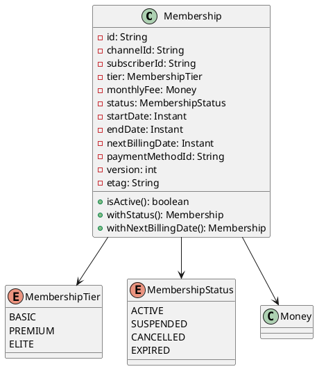
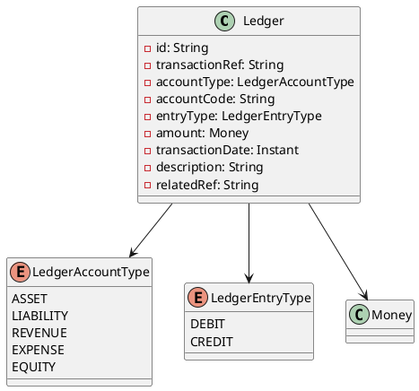
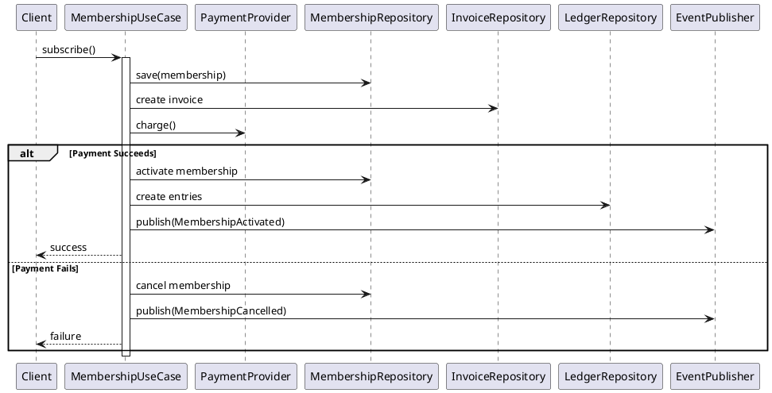

# Low-Level Design: Monetization & Billing Service

## Architecture Overview

The Monetization Service implements a hexagonal architecture with clear separation of concerns:

- **Domain Layer**: Core business logic, entities, value objects, and domain events
- **Application Layer**: Use cases, DTOs, and orchestration of domain logic
- **Infrastructure Layer**: Persistence (JPA), messaging (Service Bus), and external integrations

## Domain Model

### Entity Relationship Diagram

```
┌─────────────────┐
│   Membership    │
│  (Aggregate     │
│    Root)        │
└────────┬────────┘
         │ 1:N
         │
         ▼
┌─────────────────┐     1:N    ┌──────────────┐
│    Invoice      │────────────│   Payment    │
└─────────────────┘            └──────────────┘
         │                             │
         │ 1:N                         │ 1:N
         │                             │
         ▼                             ▼
┌────────────────────────────────────────────┐
│              Ledger                        │
│  (Double-Entry Bookkeeping)                │
└────────────────────────────────────────────┘
```

### Class Diagrams

#### Membership Aggregate



#### Ledger (Double-Entry Bookkeeping)



## Application Layer

### Use Cases

1. **MembershipUseCase**: Manages membership lifecycle
   - Subscribe
   - Cancel
   - Update tier
   - List memberships

2. **PaymentUseCase**: Handles payment processing
   - Process webhook
   - Create ledger entries
   - Publish events

3. **InvoiceUseCase**: Manages invoicing
   - Generate invoices
   - Track payments
   - Export financial reports

### SAGA Pattern Implementation

The membership subscription process uses the SAGA pattern:



## Infrastructure Layer

### Persistence

- **Repository Pattern**: Domain repositories with JPA implementations
- **Unit of Work**: Transaction management via Spring @Transactional
- **Optimistic Locking**: ETag-based concurrency control

### Event Publishing (Outbox Pattern)

```
Application → Outbox Table → Outbox Processor → Service Bus
```

### Idempotency

- Redis-based deduplication
- Idempotency-Key header validation
- 24-hour TTL for keys

## Security

### Authentication & Authorization

- OAuth2 Resource Server with JWT validation
- Entra External ID/B2C integration
- Role-based access control (RBAC)

### Webhook Security

- HMAC-SHA256 signature verification
- Secret stored in Azure Key Vault
- Request replay ofense

## Resilience

### Circuit Breaker

```yaml
payment-provider:
  slidingWindowSize: 20
  failureRateThreshold: 70%
  waitDurationInOpenState: 10s
```

### Retry

```yaml
payment-webhook:
  maxAttempts: 3
  waitDuration: 2s
```

### Rate Limiting

```yaml
default:
  limitForPeriod: 10
  limitRefreshPeriod: 1s
```

## Observability

### Logging

- Structured JSON logging
- Correlation ID propagation
- Trace context injection

### Metrics

- Custom metrics for payments, memberships, invoices
- Prometheus endpoint
- Grafana dashboards

### Tracing

- OpenTelemetry integration
- Azure Monitor export
- Distributed tracing across services

## Testing Strategy

### Unit Tests
- Domain logic
- Value objects
- Use cases

### Integration Tests
- Testcontainers for PostgreSQL
- Redis embedded
- WireMock for external services

### Contract Tests
- API contracts
- Event schemas
- Webhook payloads

### Load Tests
- JMH benchmarks
- Gatling simulations
- Stress testing

## Deployment

### Container Image

```dockerfile
FROM distroless:java17
```

- Minimal attack surface
- Non-root user
- Optimized size

### Kubernetes Resources

- Deployment (3 replicas)
- HorizontalPodAutoscaler
- Service
- NetworkPolicy
- PodDisruptionBudget

### Health Checks

- Liveness: `/actuator/health/liveness`
- Readiness: `/actuator/health/readiness`

## Compliance

### Financial Regulations

- Double-entry bookkeeping
- Audit trail
- Strong consistency
- Data retention policies

### GDPR

- Right to access
- Right to erasure
- Data portability
- Privacy by design

