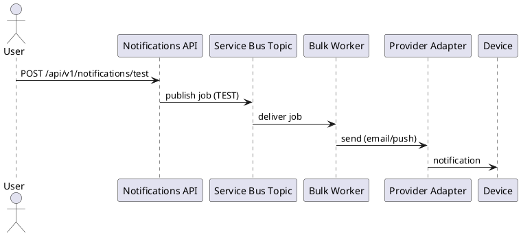

### Test Notification Flow

```plantuml
@startuml
actor User
participant API as "Notifications API"
participant SB as "Service Bus Topic"
participant Worker as "Bulk Worker"
participant Provider as "Provider Adapter"
participant Device

User -> API: POST /api/v1/notifications/test
API -> SB: publish job (TEST)
SB -> Worker: deliver job
Worker -> Provider: send (email/push)
Provider -> Device: notification
@enduml
```

