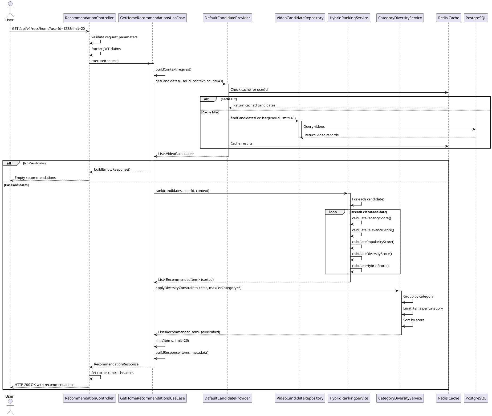

# Sequence Diagram: Get Home Recommendations

## Overview

This sequence diagram illustrates the flow of a home page recommendation request, from the REST controller through the two-stage ranking pipeline to the final response.

## PlantUML Diagram

## Key Steps

### 1. Request Validation (Controller)
- Validates `userId` and `limit` parameters
- Extracts JWT claims for user context
- Builds `RecommendationRequest` DTO

### 2. Candidate Generation (Stage 1)
- Calls `CandidateProvider.getCandidates()`
- Checks Redis cache first
- On cache miss, queries `VideoCandidateRepository`
- Deduplicates candidates by videoId
- Returns 2x limit for filtering (e.g., 40 for final 20)

### 3. Multi-Factor Ranking (Stage 2)
- Calls `HybridRankingService.rank()`
- For each candidate:
  - **Recency**: Exponential decay (30%)
  - **Relevance**: Context matching (40%)
  - **Popularity**: View normalization (20%)
  - **Diversity**: Category spread (10%)
- Returns scored and sorted `RecommendedItem[]`

### 4. Diversity Filtering (Stage 3)
- Calls `CategoryDiversityService.applyDiversityConstraints()`
- Limits items per category (max 1/3 of limit)
- Preserves score-based ordering
- Returns diversified list

### 5. Final Selection (Stage 4)
- Limits to requested count (e.g., top 20)
- Builds `RecommendationResponse` with metadata:
  - Total candidates found
  - Total returned
  - Request type
  - AB test variant
  - Timestamp

### 6. Response (Controller)
- Sets HTTP headers (Cache-Control, X-Request-ID)
- Returns JSON response to client
- Logs metrics for observability

## Performance Characteristics

- **Cache Hit**: ~50ms (Redis only)
- **Cache Miss**: ~200ms (DB query + Redis write)
- **Ranking**: ~100ms for 100 candidates
- **Total Latency**: ~300ms (p95)

## Resilience Points

1. **Redis Failure**: Falls back to direct DB query
2. **DB Latency**: Circuit breaker opens after 3 failures
3. **Ranking Timeout**: Returns partial results (5s timeout)
4. **No Candidates**: Returns empty list with metadata

## Observability

- **Metrics**: Candidates count, ranking time, cache hit rate
- **Traces**: Full request lifecycle span
- **Logs**: Request ID, user ID, recommendation count
