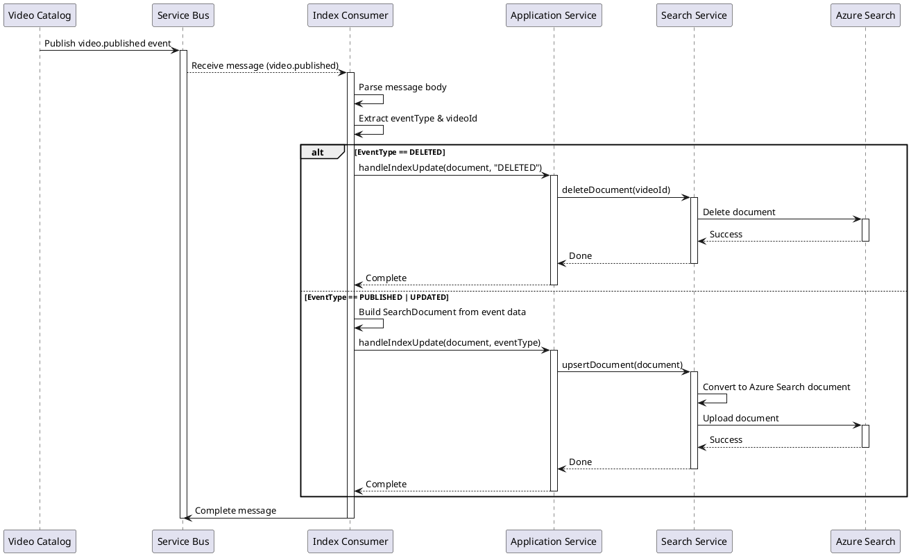

# Index Update Flow Sequence Diagram

## Description

1. **Event Publishing**: Video Catalog Service publishes events to Service Bus
2. **Message Consumption**: Index Consumer receives message with idempotency key
3. **Message Processing**:
   - Parse event type and video data
   - Build SearchDocument from event payload
   - Route to appropriate operation (upsert or delete)
4. **Index Update**: Update Azure Cognitive Search index
5. **Message Completion**: Mark message as complete (or abandon on error)

## Idempotency

- Messages include idempotency key (videoId + timestamp)
- Redis check before processing
- Already processed → skip
- Not processed → process and mark in Redis

## Error Handling

- Retry on transient failures (up to 3 times)
- Dead-letter queue for permanent failures
- Circuit breaker for Azure Search failures
