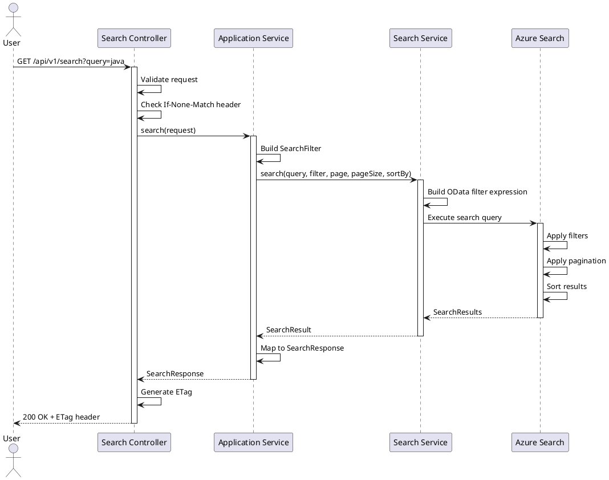

# Search Flow Sequence Diagram

## Description

1. **Request**: User sends search request with query and optional filters
2. **Validation**: Controller validates request parameters
3. **ETag Check**: Check If-None-Match for caching
4. **Application Service**: Orchestrates the search operation
5. **Filter Building**: Builds OData filter expression from filters
6. **Domain Service**: Executes search with Azure Search
7. **Azure Search**: Processes query with filters, pagination, sorting
8. **Response**: Returns paginated results with ETag for caching

## ETag Support

- Server generates ETag based on response content hash
- Client sends `If-None-Match` header for subsequent requests
- Server returns 304 Not Modified if content unchanged
