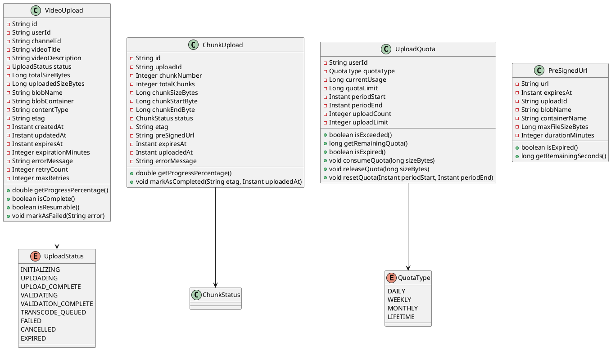
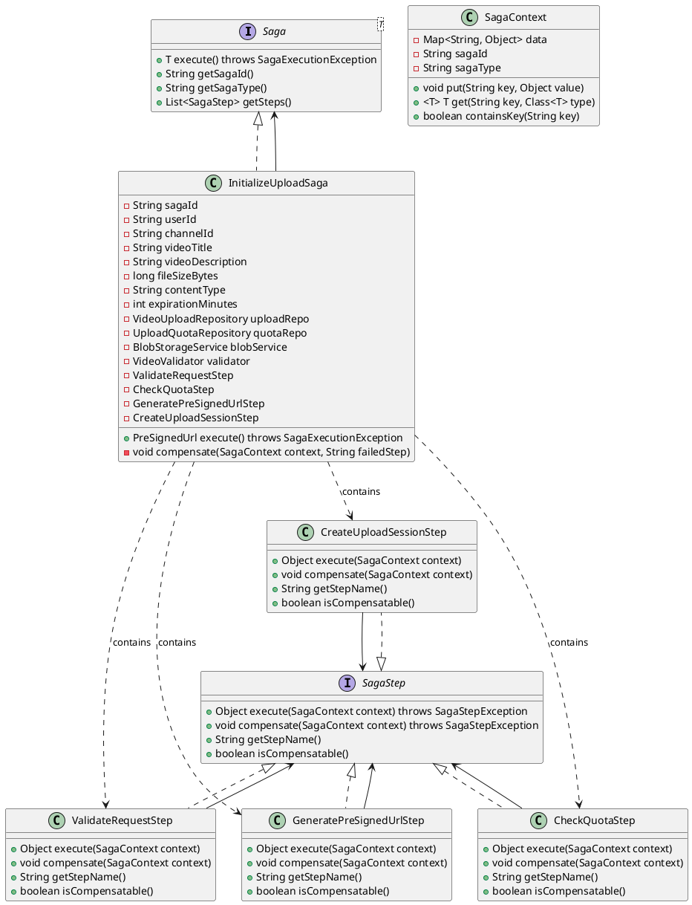
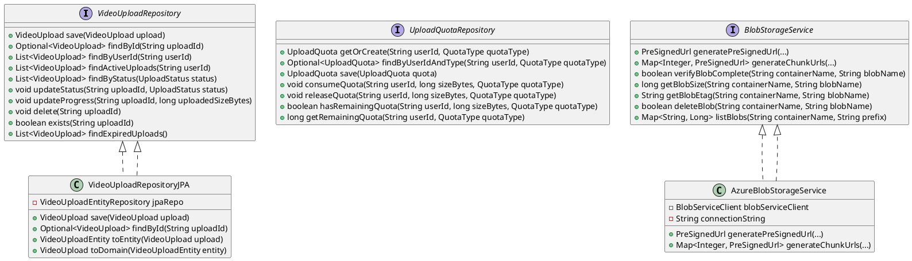
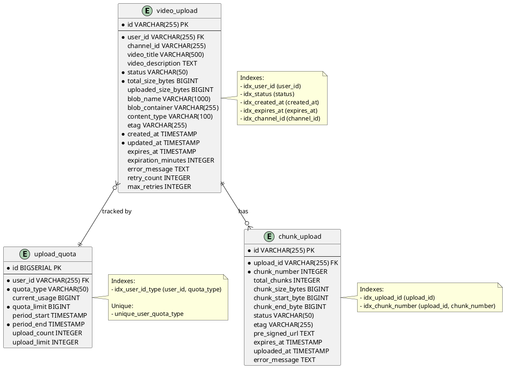
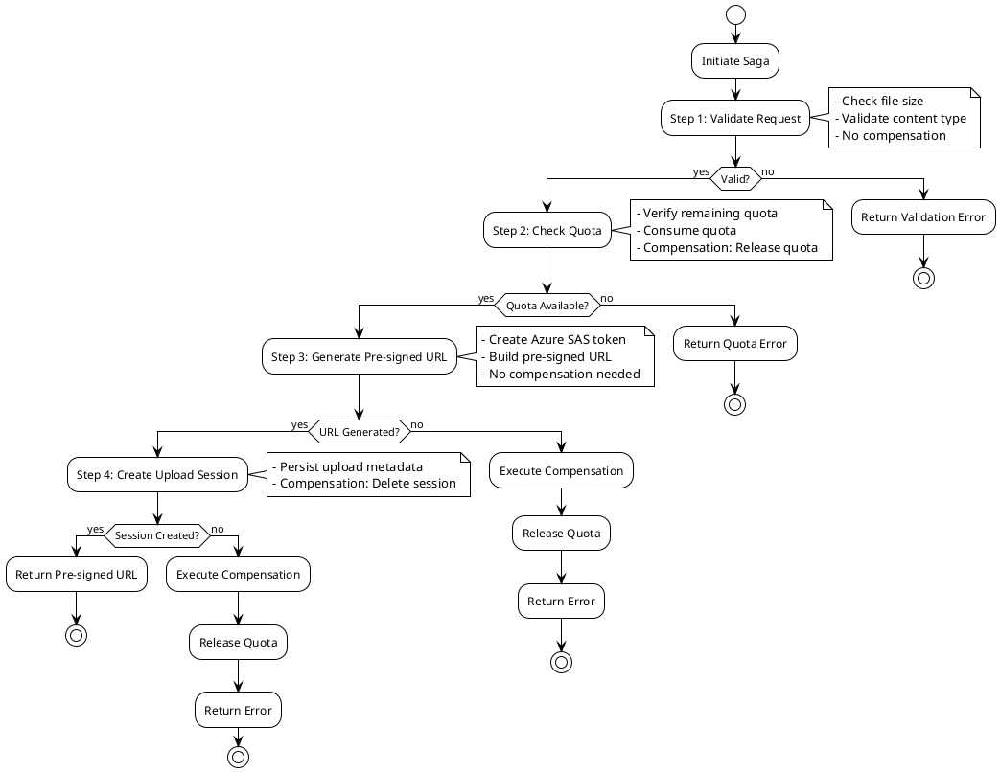

# Low-Level Design (LLD) - Video Upload Service

## Table of Contents
1. [Overview](#overview)
2. [System Architecture](#system-architecture)
3. [Class Diagrams](#class-diagrams)
4. [Database Design](#database-design)
5. [API Design](#api-design)
6. [Saga Orchestration](#saga-orchestration)
7. [Error Handling](#error-handling)
8. [Performance Considerations](#performance-considerations)
9. [Security Design](#security-design)
10. [Testing Strategy](#testing-strategy)

## Overview

### Purpose
The Video Upload Service enables users to upload video files efficiently with support for:
- Pre-signed URLs for direct client uploads
- Resumable chunked uploads
- Upload validation and quota management
- Saga-based distributed transaction orchestration

### Key Requirements

#### Functional Requirements
1. **FR1**: Initialize video upload with pre-signed URL generation
2. **FR2**: Check upload status and progress
3. **FR3**: Cancel active uploads
4. **FR4**: Enforce upload quotas (daily/weekly/monthly)
5. **FR5**: Validate upload files (size, type, format)

#### Non-Functional Requirements
1. **NFR1**: P95 start latency < 100ms
2. **NFR2**: Support multi-Gbps upload throughput
3. **NFR3**: 99.9% availability
4. **NFR4**: Support 10,000+ concurrent uploads
5. **NFR5**: Automatic retry with exponential backoff

## System Architecture

### Component Overview

```
┌─────────────────────────────────────────────────────────────┐
│                      Client Layer                            │
│  (Browser/Mobile App - Direct Blob Upload)                  │
└────────────────────┬────────────────────────────────────────┘
                     │
                     ▼
┌─────────────────────────────────────────────────────────────┐
│                    Interface Layer                           │
│  ┌──────────────────────────────────────────────────────┐   │
│  │ VideoUploadController                                 │   │
│  │  - initializeUpload()                                 │   │
│  │  - getUploadStatus()                                  │   │
│  │  - cancelUpload()                                      │   │
│  └──────────────────────────────────────────────────────┘   │
└────────────────────┬────────────────────────────────────────┘
                     │
                     ▼
┌─────────────────────────────────────────────────────────────┐
│                  Application Layer                           │
│  ┌──────────────────────────────────────────────────────┐   │
│  │ InitializeUploadSaga                                  │   │
│  │  ├─ ValidateRequestStep                               │   │
│  │  ├─ CheckQuotaStep                                    │   │
│  │  ├─ GeneratePreSignedUrlStep                         │   │
│  │  └─ CreateUploadSessionStep                           │   │
│  └──────────────────────────────────────────────────────┘   │
└────────────────────┬────────────────────────────────────────┘
                     │
                     ▼
┌─────────────────────────────────────────────────────────────┐
│                    Domain Layer                               │
│  ┌─────────────┐  ┌─────────────┐  ┌─────────────┐         │
│  │ VideoUpload │  │ChunkUpload   │  │UploadQuota   │         │
│  │   Entity    │  │   Entity     │  │   Entity    │         │
│  └─────────────┘  └─────────────┘  └─────────────┘         │
│                                                               │
│  ┌─────────────┐  ┌─────────────┐                            │
│  │BlobStorage  │  │VideoValidator│                           │
│  │  Service    │  │   Service    │                          │
│  └─────────────┘  └─────────────┘                            │
└────────────────────┬────────────────────────────────────────┘
                     │
                     ▼
┌─────────────────────────────────────────────────────────────┐
│               Infrastructure Layer                            │
│  ┌─────────────┐  ┌─────────────┐  ┌─────────────┐          │
│  │ Azure Blob  │  │  Repository  │  │  Security  │          │
│  │  Storage    │  │ Implementations│ │  Config    │          │
│  └─────────────┘  └─────────────┘  └─────────────┘          │
└────────────────────┬────────────────────────────────────────┘
                     │
                     ▼
┌─────────────────────────────────────────────────────────────┐
│                  External Services                            │
│  ┌─────────────┐  ┌─────────────┐  ┌─────────────┐          │
│  │Azure Blob   │  │Azure Service│  │   PostgreSQL│         │
│  │  Storage    │  │     Bus      │  │   Database  │         │
│  └─────────────┘  └─────────────┘  └─────────────┘          │
└───────────────────────────────────────────────────────────────┘
```

## Class Diagrams

### Domain Entities



### Application Layer - Saga Pattern



### Repository Pattern



## Database Design

### Entity-Relationship Diagram



### Schema Details

#### Table: video_upload
**Purpose**: Stores video upload sessions and metadata

| Column | Type | Constraints | Description |
|--------|------|-------------|-------------|
| id | VARCHAR(255) | PRIMARY KEY | Unique upload session ID |
| user_id | VARCHAR(255) | NOT NULL, FK | Owner of the upload |
| channel_id | VARCHAR(255) | NULL | Target channel |
| status | VARCHAR(50) | NOT NULL | Upload status (enum) |
| total_size_bytes | BIGINT | NOT NULL | Total file size |
| uploaded_size_bytes | BIGINT | DEFAULT 0 | Uploaded bytes |
| blob_name | VARCHAR(1000) | NULL | Azure blob name |
| content_type | VARCHAR(100) | NULL | MIME type |
| created_at | TIMESTAMP | NOT NULL | Creation timestamp |
| updated_at | TIMESTAMP | NOT NULL | Last update timestamp |
| expires_at | TIMESTAMP | NULL | URL expiration time |
| retry_count | INTEGER | DEFAULT 0 | Number of retry attempts |

**Indexes:**
- `idx_user_id`: For finding all uploads by user
- `idx_status`: For finding uploads by status
- `idx_created_at`: For chronological queries
- `idx_expires_at`: For cleanup of expired uploads

#### Table: upload_quota
**Purpose**: Tracks user upload quotas and consumption

| Column | Type | Constraints | Description |
|--------|------|-------------|-------------|
| id | BIGSERIAL | PRIMARY KEY | Auto-increment ID |
| user_id | VARCHAR(255) | NOT NULL, FK | Quota owner |
| quota_type | VARCHAR(50) | NOT NULL | Type (DAILY/WEEKLY/MONTHLY) |
| current_usage | BIGINT | DEFAULT 0 | Bytes used in period |
| quota_limit | BIGINT | NOT NULL | Maximum allowed bytes |
| period_start | TIMESTAMP | NULL | Period start time |
| period_end | TIMESTAMP | NOT NULL | Period end time |
| upload_count | INTEGER | DEFAULT 0 | Number of uploads |
| upload_limit | INTEGER | DEFAULT 20 | Max uploads per period |

**Indexes:**
- `idx_user_id_type`: Composite index for fast quota lookups
- `unique_user_quota_type`: Ensures one quota record per user+type

#### Table: chunk_upload
**Purpose**: Manages chunked/resumable uploads

| Column | Type | Constraints | Description |
|--------|------|-------------|-------------|
| id | VARCHAR(255) | PRIMARY KEY | Unique chunk ID |
| upload_id | VARCHAR(255) | NOT NULL, FK | Parent upload |
| chunk_number | INTEGER | NOT NULL | Chunk index (0-based) |
| chunk_size_bytes | BIGINT | NULL | Chunk size |
| status | VARCHAR(50) | NULL | Chunk status |
| etag | VARCHAR(255) | NULL | Azure blob ETag |
| pre_signed_url | TEXT | NULL | URL for this chunk |
| expires_at | TIMESTAMP | NULL | URL expiration |

## API Design

### Endpoints

#### 1. Initialize Upload

**Request:**
```http
POST /api/v1/uploads/initialize
Authorization: Bearer <jwt-token>
Content-Type: application/json

{
  "channelId": "channel-123",
  "title": "My Video",
  "description": "Video description",
  "fileSizeBytes": 524288000,
  "contentType": "video/mp4",
  "expirationMinutes": 60
}
```

**Response (200 OK):**
```json
{
  "uploadId": "uuid-123",
  "preSignedUrl": "https://storage.azure.com/container/blob?token=...",
  "expiresAt": "2024-01-01T12:00:00Z",
  "blobName": "uploads/user-123/uuid.mp4",
  "durationMinutes": 60
}
```

**Error Responses:**
- `400 Bad Request`: Invalid request payload
- `401 Unauthorized`: Missing or invalid JWT
- `403 Forbidden`: Insufficient quota
- `500 Internal Server Error`: System error

#### 2. Get Upload Status

**Request:**
```http
GET /api/v1/uploads/{uploadId}/status
Authorization: Bearer <jwt-token>
```

**Response (200 OK):**
```json
{
  "uploadId": "uuid-123",
  "status": "UPLOADING",
  "progressPercentage": 45.5,
  "totalSizeBytes": 524288000,
  "uploadedSizeBytes": 238553600,
  "errorMessage": null
}
```

**Status Values:**
- `INITIALIZING`: Upload session created, awaiting client
- `UPLOADING`: Active upload in progress
- `UPLOAD_COMPLETE`: Upload finished, validation pending
- `VALIDATION_COMPLETE`: Ready for transcode
- `FAILED`: Upload or validation failed
- `CANCELLED`: User cancelled upload
- `EXPIRED`: Pre-signed URL expired

#### 3. Cancel Upload

**Request:**
```http
POST /api/v1/uploads/{uploadId}/cancel
Authorization: Bearer <jwt-token>
```

**Response (200 OK):**
```http
HTTP/1.1 200 OK
```

**Side Effects:**
- Quota released
- Blob deleted from Azure
- Session marked as cancelled

## Saga Orchestration

### Saga Flow Diagram



### Compensation Logic

| Step | Compensation Action | Compensatable |
|------|-------------------|----------------|
| Validate Request | None (read-only) | No |
| Check Quota | Release consumed quota | Yes |
| Generate Pre-signed URL | None (idempotent) | No |
| Create Upload Session | Delete upload record | Yes |

## Error Handling

### Error Categories

1. **Validation Errors** (400): Invalid input
   - File size out of range
   - Unsupported content type
   - Missing required fields

2. **Quota Errors** (403): Resource limits exceeded
   - Daily quota exceeded
   - Upload count limit reached

3. **Infrastructure Errors** (500): System failures
   - Azure Blob Storage unavailable
   - Database connection failures
   - Network timeouts

4. **Authorization Errors** (401/403): Security violations
   - Invalid JWT token
   - Unauthorized access attempt

### Resilience Strategies

1. **Retry Logic**: Exponential backoff for transient failures
2. **Circuit Breaker**: Fail-fast for persistent failures
3. **Timeout Handling**: Prevent hanging operations
4. **Graceful Degradation**: Degrade functionality rather than fail completely

## Performance Considerations

### Query Optimization

1. **Use Indexes**: All foreign keys and frequently queried columns indexed
2. **Pagination**: Limit result sets for list queries
3. **Connection Pooling**: Efficient database connection management
4. **Caching**: Cache frequently accessed data (Redis)

### Latency Targets

| Operation | P50 | P95 | P99 |
|-----------|-----|-----|-----|
| Initialize Upload | 50ms | 100ms | 200ms |
| Get Status | 10ms | 20ms | 50ms |
| Cancel Upload | 100ms | 200ms | 500ms |

### Scalability

1. **Horizontal Scaling**: Stateless design allows unlimited scaling
2. **Read Replicas**: Separate read/write databases
3. **CDN**: Cache static content
4. **Async Processing**: Background job processing

## Security Design

### Authentication
- OAuth2 Resource Server with JWT tokens
- Token validation on every request
- User ID extraction from JWT subject claim

### Authorization
- Role-based access control (RBAC)
- User ownership verification
- Quota enforcement per user

### Data Protection
- Pre-signed URLs with time-limited access
- SAS tokens with write-only permissions
- HTTPS/TLS for all communications
- Secure credential storage

## Testing Strategy

### Unit Tests
- Saga step execution and compensation
- Repository operations
- Quota enforcement logic
- Validation rules

### Integration Tests
- End-to-end upload flow
- Saga orchestration
- Azure Blob Storage integration
- Database operations

### Performance Tests
- Latency benchmarks
- Throughput measurements
- Concurrent upload handling
- Load testing with 10,000+ concurrent requests

### Security Tests
- Authentication bypass attempts
- Authorization failures
- SQL injection attempts
- XSS and CSRF attacks

